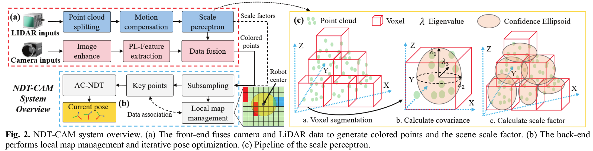
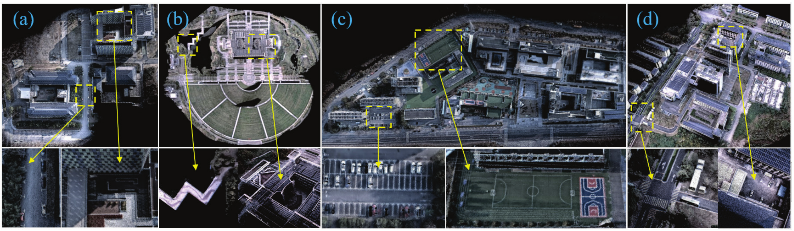

# 🚀 NDT-CAM: A Simple, Adaptive, and Robust Visual-Assisted LiDAR Odometry for High-Altitude Mapping

NDT-CAM is a visual-assisted LiDAR odometry system designed for **high-altitude mapping** scenarios.  
It aims to provide **robust**, **adaptive**, and **accurate** odometry performance in **sparse**, **scale-varying**, and **degeneration-prone** environments.

---

## 📌 1. System Overview



---

## 📈 2. Performance



---

## 🎥 3. Experimental Video

[YouTube Demo](https://www.youtube.com/watch?v=UKfhbmbfFlM)

---

## 📂 4. Dataset

**Baidu Netdisk:**  
https://pan.baidu.com/s/1tPx2HpEWGjJUuKa0NN8XPw?pwd=v9er

**Extraction code:** `v9er`

---

## 🛠️ 5. Requirements

### ✅ Recommended Environment

- Ubuntu 20.04
- ROS Noetic
- Catkin tools
- C++14 compiler

### 📦 Main Dependencies

- `roscpp`
- `sensor_msgs`
- `nav_msgs`
- `tf2`
- `tf2_ros`
- `cv_bridge`
- `PCL`
- `OpenCV 4`
- `Eigen3`
- `Sophus`
- `TBB`
- `OpenMP`
- `glog`
- `livox_ros_driver` (for Livox-based setups)

---

## ⚙️ 6. Installation

This repository is already organized as a **Catkin workspace**.  
Build it from the workspace root.

### 6.1 Build the workspace

```bash
cd /path/to/ndt_cam
source /opt/ros/noetic/setup.bash
catkin build ndt_cam
source devel/setup.bash
```

### 6.2 Install dependencies

For **Ubuntu 20.04 + ROS Noetic**, you can use the following one-command setup on a fresh machine:

```bash
sudo apt update
sudo apt install -y \
  build-essential \
  cmake \
  git \
  pkg-config \
  python3-catkin-tools \
  libeigen3-dev \
  libgoogle-glog-dev \
  libomp-dev \
  libopencv-dev \
  libpcl-dev \
  libtbb-dev \
  ros-noetic-ros-base \
  ros-noetic-geometry-msgs \
  ros-noetic-nav-msgs \
  ros-noetic-sensor-msgs \
  ros-noetic-std-msgs \
  ros-noetic-tf2 \
  ros-noetic-tf2-ros \
  ros-noetic-cv-bridge \
  ros-noetic-pcl-conversions \
  ros-noetic-rosbag \
  ros-noetic-image-transport
```

## 7. Configuration

The main configuration files are located in:

```bash
src/ndt-cam/ndt_cam/ros/config
```
Before running the system, check the selected YAML file and update at least:

- `common/lidar_topic`
- `common/image_topic`
- `common/ROOT_DIR`
- frame names such as `common/odom_frame` and `common/child_frame`
- sensor-specific parameters under `ndt_cam_l` and `ndt_cam_v`

Example:

```yaml
common:
  lidar_topic: "/livox/lidar"
  image_topic: "/hikrobot_camera/rgb"
  ROOT_DIR: "/path/to/output/results"
```

## 8. Running

### 1. Build and source the workspace

```bash
cd /path/to/ndt_cam
source /opt/ros/noetic/setup.bash
catkin build ndt_cam
source devel/setup.bash
```

### 2. Launch the odometry node

For Livox:

```bash
roslaunch ndt_cam livox.launch
```
### 3. View results in RViz

The launch files already start RViz by default using:

```bash
src/ndt-cam/ndt_cam/ros/rviz/ndt_cam_ros1.rviz
```

If you want to run RViz manually:

```bash
rviz -d /path/to/ndt_cam/src/ndt-cam/ndt_cam/ros/rviz/ndt_cam_ros1.rviz
```

## 9. Published Topics

The main node name is:

```bash
ndt_cam_node
```

Typical published topics include:

- `/ndt_cam_node/odometry`
- `/ndt_cam_node/trajectory`
- `/ndt_cam_node/frame`
- `/ndt_cam_node/keypoints`
- `/ndt_cam_node/local_map`
- `/ndt_cam_node/feather_image`

## 10. Output Files

If saving is enabled in the YAML configuration, results are written under `common/ROOT_DIR`, for example:

- `ndt_cam.txt`
- `gps.txt`
- saved PCD files

Additional internal logs may also be written to:

```bash
src/ndt-cam/ndt_cam/ros/results
```

