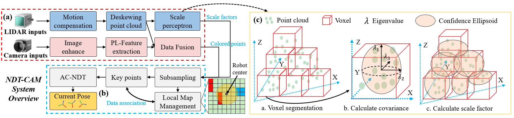

# NDT-CAM: A Light, Real-time and Accuracy Visual-assisted LiDAR SLAM for High Altitude Surveying and Mapping
The code will be made publicly available after the paper is accepted.
## 1.System overview

## 2.Performance

## 3.Experimental Video
https://www.youtube.com/watch?v=UKfhbmbfFlM
